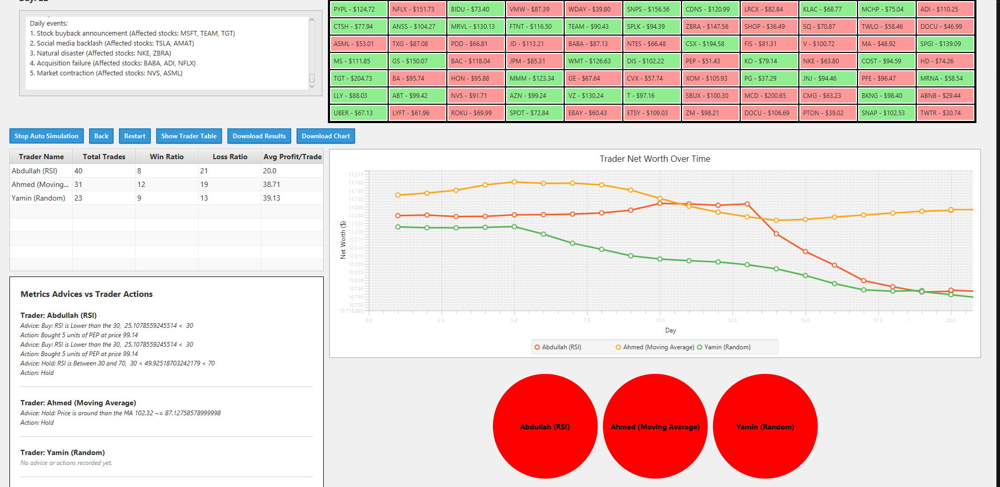
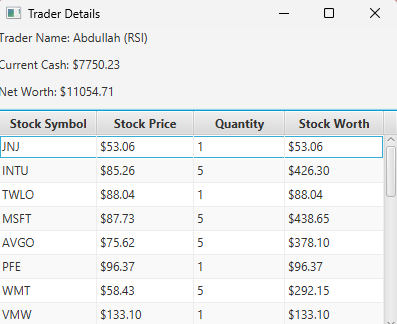

# Readme
This project was part of the EE-364 Course at King Abdulaziz University, The project is designed for educational purposes, providing insight into Object-Oriented Programming (OOP) concepts in Java, and demonstrates the real-world application of algorithms in stock trading simulations.
# Market Simulator 

## Overview

This application simulates a market environment where different types of traders use various strategies to trade stocks. The main goal is to compare the performance of different traders responding to market events. Phase 1 includes a simple simulation with random events, while Phase 2 introduces an advanced Trader Bot using complex algorithms.



## Phase 1: Simple Market Simulation
This project uses a **CSV file** to load stock data and market events, which are then processed during the simulation. The application showcases how different traders with varied strategies perform in the market based on random stock price events.

### Features of Phase 1:

- **Market Events**: Random events affect stock prices and traders make decisions based on these events.
  
- **Trader Strategies**:
  - **Random Strategy**: The Random Trader makes decisions purely based on randomness.
  - **RSI Strategy**: The RSI Trader uses the **Relative Strength Index (RSI)** to determine when to buy or sell stocks.
  - **MA Strategy**: The MA Trader uses the **Moving Average Index** to determine when to buy or sell stocks.


### Example Code: initializing the Market

This is the simplified Market Simulator Class

```java
public class MarketSimulator {
    private List<Stocks> stockList;

    public MarketSimulator() {
        this.stockList = new ArrayList<>();
        loadStocksFromCSV("stocks.csv");
        loadEventsFromCSV("events.csv");
    }

    private void loadStocksFromCSV(String fileName) {
        try (BufferedReader reader = new BufferedReader(new FileReader(fileName))) {
            String line;
            while ((line = reader.readLine()) != null) {
                String[] data = line.split(",");
                String symbol = data[0];
                double price = Double.parseDouble(data[1]);
                stockList.add(new Stocks(symbol, price));
            }
        } catch (IOException e) {
            e.printStackTrace();
        }
    }

    private void loadEventsFromCSV(String fileName) {
        // Load market events from CSV and process them
    }
}
```
---
### Data Display
A table for each Trader is initialized which shows their
- Networth
- Current Cash in $
- Stock Portfolio 
and this can track the progress of each Trader in a way more detailed than the Line Chart.


---

### Phase 2: Advanced Trader Bot

# Trader Bot:
The Trader Bot uses advanced algorithms to make more accurate trading decisions. It tracks stock prices, monitors market volatility, and implements more complex measures like stop-loss and profit-grab strategies.

# Advanced Trading Strategy: 
The bot uses a combination of RSI and momentum analysis, tracking the highest price of each stock and making more informed decisions.

## Code Example: Trader Bot
The Trader Bot tracks the highest price of each stock and uses this data to determine when to sell. It also applies profit grab and stop loss techniques. 

___Class definition and constructors___
```java
public class TradingBotTrader extends Trader {
    private int period;
    private static final double STOP_LOSS_PERCENTAGE = 0.10; // 10% stop-loss
    private static final double PROFIT_GRAB_PERCENTAGE = 0.35; // 35% profit-grab
    private Map<Stocks, Double> highestPriceTracker; // Track the highest price of each stock
    private Map<Stocks, Integer> soldStocks; // Track sold stocks and the day they were sold
    private Map<Stocks, Long> purchaseTimeTracker; // Track purchase time of stocks

    public TradingBotTrader(String name, int period, MarketSimulator market) {
        super(name, market);
        this.period = period;
        this.highestPriceTracker = new HashMap<>();
        this.soldStocks = new HashMap<>();
        this.purchaseTimeTracker = new HashMap<>();
    }
}
```
___RSI Calculation___
```java 
public double calculate(int period, List<Double> priceHistory) {
    try {
        if (priceHistory.size() < period) {
            return 50.0; // Neutral RSI
        }

        double gain = 0;
        double loss = 0;

        for (int j = priceHistory.size() - period + 1; j < priceHistory.size(); j++) {
            double change = priceHistory.get(j) - priceHistory.get(j - 1);
            if (change > 0) {
                gain += change;
            } else {
                loss -= change;
            }
        }

        double avgGain = gain / period;
        double avgLoss = loss / period;

        return avgLoss == 0 ? 100 : 100 - (100 / (1 + (avgGain / avgLoss)));
    } catch (Exception e) {
        return 50.0; // Return neutral RSI value on error
    }
}
```

___Stop-Loss and Profit-Grab Logic___
```Java
private void applyStopLossAndProfitGrab() {
    Map<Stocks, Integer> portfolioCopy = new HashMap<>(getStockPortfolio());
    for (Map.Entry<Stocks, Integer> entry : portfolioCopy.entrySet()) {
        Stocks stock = entry.getKey();
        int ownedQuantity = entry.getValue();
        double currentPrice = stock.getPrice();

        highestPriceTracker.put(stock, Math.max(highestPriceTracker.getOrDefault(stock, 0.0), currentPrice));

        double highestPrice = highestPriceTracker.get(stock);
        double purchasePrice = stock.getPriceHistory().get(0);
        double profitPercentage = (currentPrice - purchasePrice) / purchasePrice;

        if (currentPrice < highestPrice * (1 - STOP_LOSS_PERCENTAGE)) {
            sell(stock, ownedQuantity, currentPrice);
            highestPriceTracker.remove(stock);
            soldStocks.put(stock, 0);
            purchaseTimeTracker.remove(stock);
        }

        if (profitPercentage >= PROFIT_GRAB_PERCENTAGE) {
            sell(stock, ownedQuantity, currentPrice);
            highestPriceTracker.remove(stock);
            soldStocks.put(stock, 0);
            purchaseTimeTracker.remove(stock);
        }
    }
}
```
### Conculsion  
We would like to express our sincere gratitude to our instructor and the team for their valuable guidance and collaboration throughout this project. This project allowed us to implement and experiment with different trading strategies while applying key Object-Oriented Programming (OOP) concepts using Java. It also gave us the opportunity to explore good coding practices, improve our problem-solving skills, and understand the importance of designing scalable and maintainable systems.

Through this hands-on experience, we have gained a deeper understanding of OOP principles such as inheritance, polymorphism, encapsulation, and abstraction, all of which were essential in building and refining the market simulation. The project also allowed us to experiment with various design patterns and programming techniques that are important for creating robust software systems.

We believe that this project demonstrates a great learning experience and enhances our knowledge in both software development and financial market simulations.

